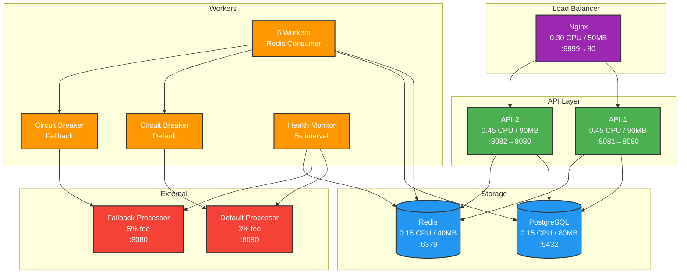
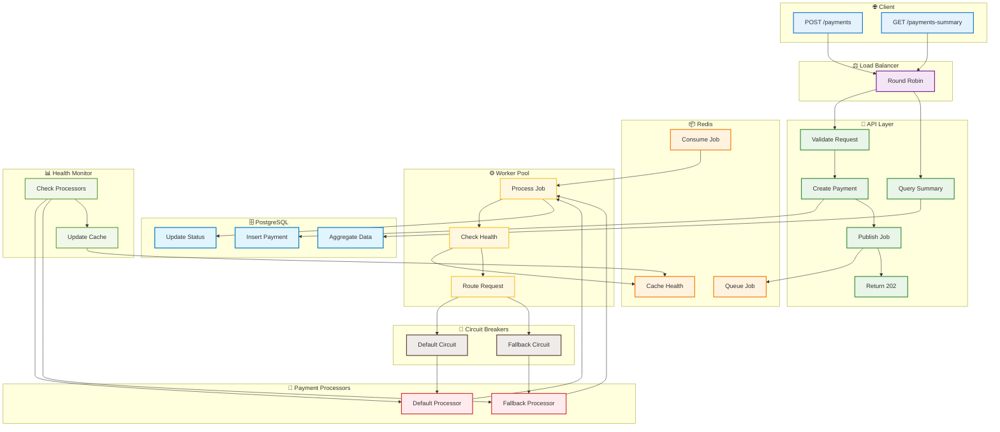

# Rinha Backend 2025 - Architecture Flow

## System Overview

## Payment Processing Flow (Swimlane)

## Resource Allocation

| Component | CPU | Memory | Port | Instances |
|-----------|-----|--------|------|-----------|
| Nginx | 0.30 | 50MB | 9999 | 1 |
| API-1 | 0.45 | 90MB | 8081 | 1 |
| API-2 | 0.45 | 90MB | 8082 | 1 |
| PostgreSQL | 0.15 | 80MB | 5432 | 1 |
| Redis | 0.15 | 40MB | 6379 | 1 |
| **Total** | **1.50** | **350MB** | - | **5** |

## Data Flow

### Payment Processing
1. **Client** → POST `/payments` → **Nginx**
2. **Nginx** → Round robin → **API Instance**
3. **API** → Create payment → **PostgreSQL**
4. **API** → Publish job → **Redis Queue**
5. **Worker** → Consume job → **Redis**
6. **Circuit Breaker** → Route to processor → **External API**
7. **Worker** → Update status → **PostgreSQL**

### Health Monitoring
1. **Health Monitor** → Check every 5s → **External APIs**
2. **Health Monitor** → Cache status → **Redis** (TTL 30s)
3. **APIs** → Read health cache → **Redis**
4. **Circuit Breakers** → Use health status → Decision logic

## Key Components

### Circuit Breakers
- **Default**: 3 max req, 30s timeout, 60% failure threshold
- **Fallback**: 5 max req, 45s timeout, 80% failure threshold

### Redis Usage
- **Queue**: `payments:queue` - Job persistence
- **Health Cache**: `health:default`, `health:fallback` - Status cache

### Worker Pool
- **5 Workers** consuming from Redis
- **Block-pop** with 10s timeout
- **Async processing** with status updates

## External Dependencies

- **payment-processor-default**: Primary processor (3% fee)
- **payment-processor-fallback**: Backup processor (5% fee)
- **Docker Network**: `payment-processor` (external)

## Endpoints

- `GET /health` - Database health
- `POST /payments` - Create payment (202 Accepted)
- `GET /payments-summary` - Aggregated data
- `DELETE /payments` - Clear all payments

## Features

✅ **Job Persistence** - Redis queues survive restarts  
✅ **Circuit Protection** - Intelligent failure handling  
✅ **Health Caching** - Efficient processor monitoring  
✅ **Load Balancing** - 2 API instances with Nginx  
✅ **Resource Compliance** - 1.5 CPU / 350MB total